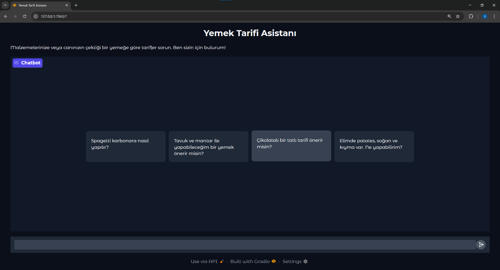
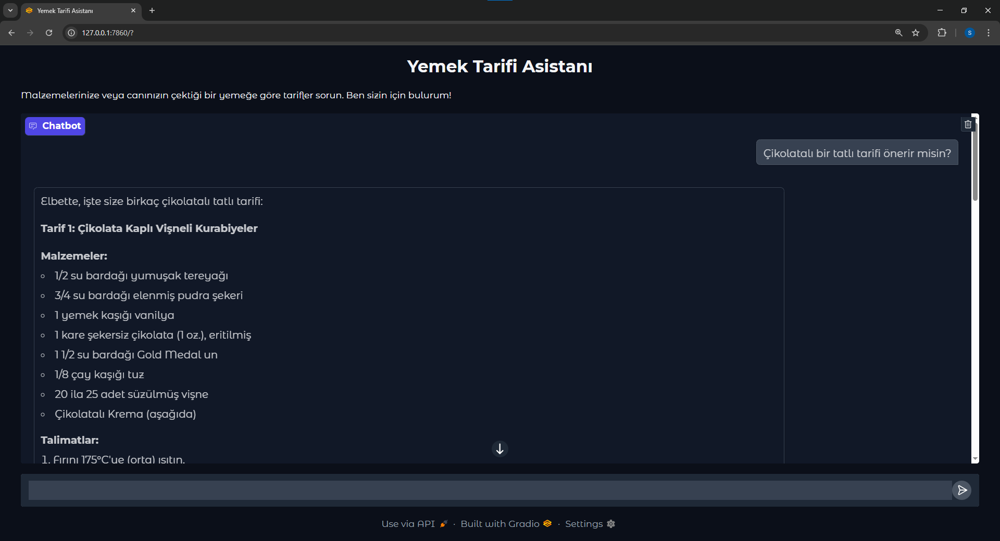
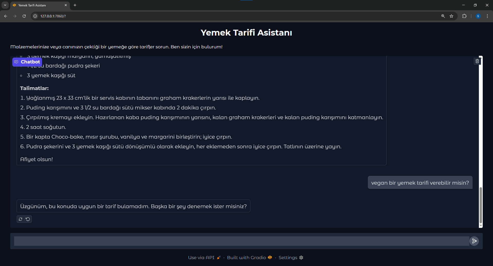

# Akbank GenAI Bootcamp - RAG Projesi: Yemek Tarifi Asistanı

Bu proje, Akbank GenAI Bootcamp kapsamında geliştirilmiş, Retrieval-Augmented Generation (RAG) mimarisi kullanan bir yemek tarifi chatbot'udur. Kullanıcıların girdilerine göre en uygun tarifleri bularak sunar.

## Projenin Amacı

Projenin temel amacı, kullanıcıların elindeki malzemeleri veya canının çektiği bir yemeği sorgu olarak girmesine olanak tanıyan ve bu sorgulara karşılık olarak geniş bir tarif veri setinden en uygun tarifleri getiren bir RAG tabanlı chatbot geliştirmektir. Chatbot, bulunan tarifleri anlaşılır bir formatta (Başlık, Malzemeler, Talimatlar) sunar.

## Veri Seti

Bu projede, [RecipeNLG](https://github.com/Glorf/recipenlg) veri seti temel alınmıştır. RecipeNLG, INLG 2020'de sunulan "RecipeNLG: A Cooking Recipes Dataset for Semi-Structured Text Generation" makalesi için hazırlanmış, 2.2 milyondan fazla yemek tarifi içeren devasa bir koleksiyondur.

Projede, `manual_data/full_dataset.csv` dosyasında veri setinin tamamı bulunmaktadır. Ancak testleri hızlı yapabilmek için, `index_data.py` scripti bu veri setinden yalnızca 10,000 tarifi işleyerek vektör veritabanına kaydeder. Her tarif aşağıdaki gibi yarı yapılandırılmış veriler içerir:

- **Title:** Yemeğin adı
- **Ingredients:** Gerekli malzemelerin listesi
- **Directions:** Yemeğin hazırlanış talimatları
- **Link:** Orijinal tarif linki
- **Source:** Verinin kaynağı
- **NER:** Malzemelerle ilgili isimlendirilmiş varlık tanıma bilgisi

Veri işleme (`index_data.py`) sırasında bu bilgiler birleştirilerek RAG mimarisi için vektör veritabanına uygun hale getirilmiştir.

## Kullanılan Yöntemler ve Çözüm Mimarisi

Proje, RAG (Retrieval-Augmented Generation) mimarisini temel alır. Bu mimari, LLM'lerin (Büyük Dil Modelleri) yeteneklerini, harici bir bilgi kaynağından (vektör veritabanı) alınan ilgili verilerle zenginleştirir.

1.  **Veri İşleme ve Vektör Veritabanı (Vector Database):**

    - `index_data.py` scripti, `full_dataset.csv` dosyasındaki tarifleri okur.
    - Her tarif, "Başlık", "Malzemeler" ve "Talimatlar" bölümlerini içeren bir metin bloğuna dönüştürülür.
    - `sentence-transformers/paraphrase-multilingual-mpnet-base-v2` modeli kullanılarak bu metinler vektörlere (embeddings) çevrilir.
    - Oluşturulan vektörler, verimli arama ve getirme işlemleri için **FAISS (Facebook AI Similarity Search)** vektör veritabanına kaydedilir.

2.  **Bilgi Getirme (Retrieval):**

    - Kullanıcı bir sorgu girdiğinde (`app.py`), bu sorgu ilk olarak **MultiQueryRetriever**'a gönderilir. Bu retriever, LLM kullanarak orijinal sorgudan birden fazla alt sorgu üretir ve bu sorguları vektör veritabanında çalıştırarak daha zengin ve çeşitli sonuçlar elde eder.
    - FAISS veritabanı, bu sorgulara en benzer tarifleri (vektörleri) bularak geri döndürür.

3.  **Yanıt Üretme (Generation):**

    - Retriever tarafından bulunan tarifler, bir prompt şablonu aracılığıyla **Google Gemini 2.0 Flash** modeline "bağlam" (context) olarak sunulur.
    - LLM, bu bağlamı ve kullanıcının orijinal sorusunu kullanarak, tarifi anlaşılır ve düzenli bir formatta sunan bir yanıt üretir.

4.  **Web Arayüzü:**
    - Proje, **Gradio** kütüphanesi kullanılarak oluşturulmuş basit ve kullanıcı dostu bir web arayüzü üzerinden sunulmaktadır.

## Sonuçlar

Bu RAG tabanlı yemek tarifi asistanı projesi, kullanıcıların doğal dil sorgularına yanıt olarak geniş bir tarif veri setinden ilgili tarifleri başarıyla getirme ve sunma yeteneğini göstermiştir. `MultiQueryRetriever` kullanımı, sorgu çeşitliliğini artırarak daha kapsamlı ve alakalı sonuçlar elde edilmesine yardımcı olmuştur. `Google Gemini 2.0 Flash` modelinin entegrasyonu sayesinde, getirilen tarifler kullanıcı dostu ve anlaşılır bir formatta sunulabilmektedir.

Proje, özellikle malzeme bazlı veya yemek adı odaklı sorgularda yüksek performans sergilemektedir. Kullanıcılar, eldeki malzemelerle ne yapabileceklerini veya belirli bir yemek türü için tarifleri kolayca keşfedebilirler.

Gelecekteki geliştirmeler arasında, tariflerin besin değerleri gibi ek meta verilerle zenginleştirilmesi, kullanıcı tercihlerine göre kişiselleştirilmiş tarif önerileri sunulması ve daha karmaşık doğal dil anlama yeteneklerinin entegrasyonu yer alabilir.

## Kodun Çalıştırılması

Projeyi yerel makinenizde çalıştırmak için aşağıdaki adımları izleyin:

1.  **Depoyu Klonlayın:**

    ```bash
    git clone https://github.com/salihalpkara/RAG-Yemek-Tarifi-Asistani
    cd RAG-Yemek-Tarifi-Asistani
    ```

2.  **Sanal Ortam Oluşturun ve Aktive Edin:**

    ```bash
    # Windows
    python -m venv venv
    .\venv\Scripts\activate
    ```

3.  **Gerekli Kütüphaneleri Yükleyin:**
    Proje için gerekli tüm kütüphaneler `requirements.txt` dosyasında belirtilmiştir.

    ```bash
    pip install -r requirements.txt
    ```

4.  **API Anahtarını Ayarlayın:**
    Proje kök dizininde `.env` adında bir dosya oluşturun ve içine Google API anahtarınızı aşağıdaki gibi ekleyin:

    ```
    GOOGLE_API_KEY="YOUR_API_KEY"
    ```

5.  **Vektör Veritabanını Oluşturun:**
    Eğer `faiss_recipe_index` klasörü mevcut değilse veya indeksi yeniden oluşturmak istiyorsanız, aşağıdaki komutu çalıştırın. Bu işlem, veri setini işleyerek vektör veritabanını oluşturacaktır.

    ```bash
    python index_data.py
    ```

6.  **Uygulamayı Başlatın:**
    Aşağıdaki komut ile Gradio arayüzünü başlatabilirsiniz.
    ```bash
    python app.py
    ```
    Uygulama başlatıldıktan sonra size verilen yerel URL (genellikle `http://127.0.0.1:7860`) üzerinden arayüze erişebilirsiniz.

## Web Arayüzü ve Kullanım Kılavuzu

Uygulama başlatıldığında sizi "Yemek Tarifi Asistanı" başlıklı bir sohbet arayüzü karşılar.

- **Soru Sorma:** Metin kutusuna elinizdeki malzemeleri ("domates, soğan ve biberle ne yapabilirim?"), canınızın çektiği bir yemeği ("tavuklu bir makarna tarifi") veya genel bir kategori ("çikolatalı tatlı") yazarak soru sorabilirsiniz.
- **Yanıt Alma:** Chatbot, veri tabanından bulduğu en uygun tarifi "Başlık", "Malzemeler" ve "Talimatlar" olarak ayrılmış şekilde size sunacaktır.

* **Örnek Sorular:** Arayüzde denemeniz için birkaç örnek soru bulunmaktadır.

Aşağıda uygulamanın ekran görüntülerini bulabilirsiniz:

### Karşılama Ekranı



### Örnek Sorgu ve Cevap



### Tarif Bulunamama Durumu



## Proje Linki

Projeyi canlı olarak denemek için aşağıdaki linki ziyaret edebilirsiniz:

https://huggingface.co/spaces/salihalpkara/RAG-Yemek-Tarifi-Asistani